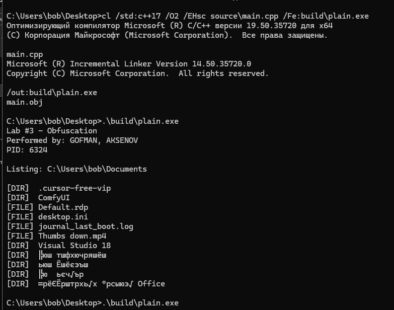
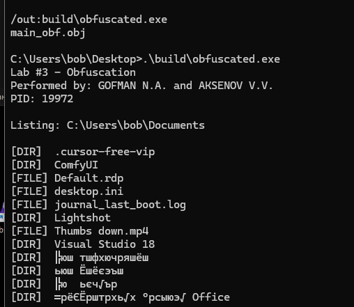
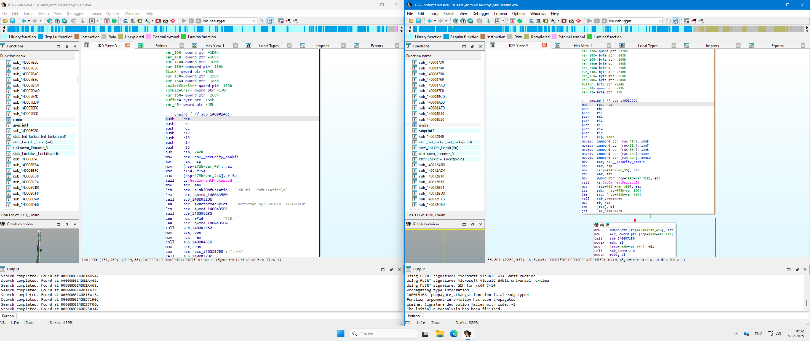
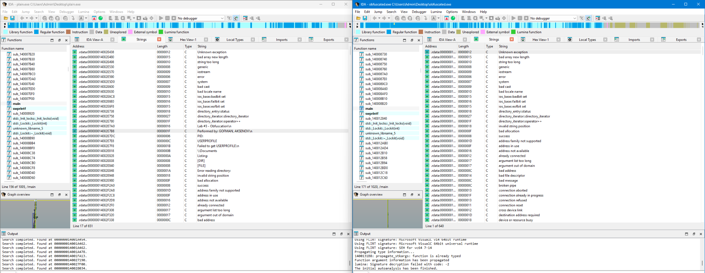
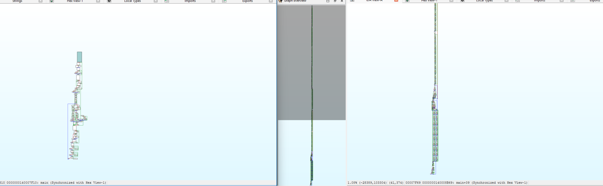
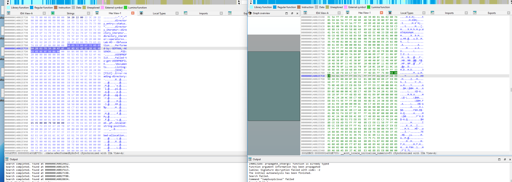

# Лабораторная работа №3  
## Средства обфускации программного кода

---

### Выполнили:
- студент 5 курса группы **21-КАС-1**  
  **Гофман Никита Антонович**
- студент 5 курса группы **21-КАС-1**  
  **Аксенов Владислав Вячеславович**

---

## Цель работы

Изучить принципы и практическое применение средств обфускации программного кода,
а также оценить влияние обфускации на результаты статического анализа исполняемых файлов
с использованием дизассемблера **IDA Pro**.

---

## Используемые инструменты

- Язык программирования: **C++**
- Компилятор: **MSVC (Visual Studio Build Tools)**
- Обфускатор: **obfusheader.h**  
  https://github.com/ac3ss0r/obfusheader.h
- Дизассемблер: **IDA Pro**
- ОС: **Windows**

---

## Исходный код программы

- 🔹 **Необфусцированная версия:**  
  [`source/plain.cpp`](source/plain.cpp)

- 🔹 **Обфусцированная версия:**  
  [`source/obfuscated.cpp`](source/obfuscated.cpp)

---

## Задание

1. Реализовать программу, выполняющую:
   - системный вызов;
   - вывод фамилий выполнивших работу;
   - вывод списка файлов и каталогов из директории `Documents`.
2. Скомпилировать программу без обфускации (`plain.exe`).
3. Выполнить дизассемблирование `plain.exe` в IDA Pro.
4. Применить обфускацию с использованием `obfusheader.h`.
5. Скомпилировать обфусцированную версию (`obfuscated.exe`).
6. Выполнить дизассемблирование `obfuscated.exe`.
7. Сравнить результаты статического анализа.

---

## Результат выполнения программы

### Обычная версия

### Обфусцированная версия

📌 Поведение программ полностью идентично.

---

## Сравнительный анализ в IDA Pro

---

### Импортируемые функции (Imports)

**Анализ:**  
В необфусцированной версии список импортов напрямую отражает логику программы.
В обфусцированной версии вызовы частично скрыты,
используются косвенные обращения и усложнён анализ назначения функций.

---

### Функция `main`

**Анализ:**  
В `plain.exe` функция `main` имеет линейную структуру и легко читается.
В `obfuscated.exe` поток управления усложнён:
добавлены лишние базовые блоки, переходы и обфусцированные вызовы.

---

### Строки (Strings)

**Анализ:**  
В обычной версии строки присутствуют в открытом виде.
После обфускации большинство строк зашифровано или скрыто,
что затрудняет анализ без выполнения программы.

---

### Граф потока управления (Graph View)

**Анализ:**  
Граф выполнения в обфусцированной версии значительно усложнён,
что делает восстановление логики программы трудоёмким.

---

### Hex View

**Анализ:**  
В обфусцированном бинарном файле отсутствуют читаемые сигнатуры и ASCII-строки,
что дополнительно усложняет статический анализ.

---

## Общий вывод

В ходе выполнения лабораторной работы были изучены и практически применены средства обфускации программного кода.
Была реализована программа, выполнена её компиляция и проведён статический анализ
до и после применения обфускации с использованием IDA Pro.

Результаты показали, что обфускация значительно усложняет анализ:
- логики выполнения программы;
- строк и импортируемых функций;
- структуры и графа потока управления.

При этом функциональность программы сохраняется полностью,
что подтверждает эффективность применения обфускации
для защиты программного кода от статического анализа.
